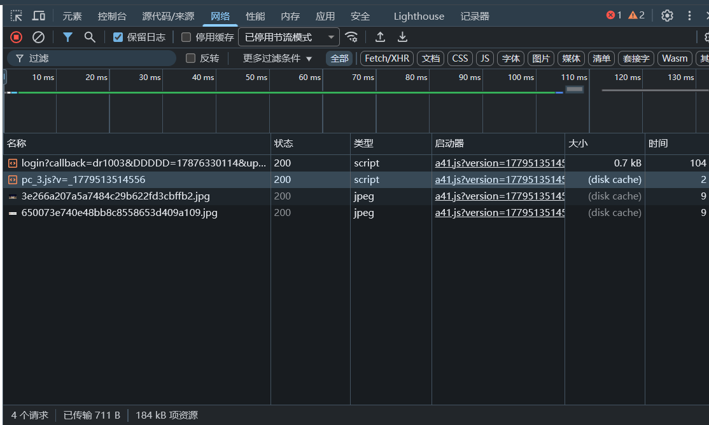
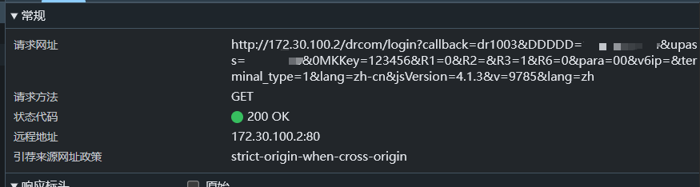

# 校园网自动登录（Windows）

适用于使用 **Dr.COM 网页认证**、且登录请求可以由脚本复现的校园网环境。

不同学校的登录地址、请求参数和成功响应可能不同。安装时先填写本校的登录请求地址，再填写账号和密码；如果参数或成功标志不同，请先修改安装脚本。

## 抓取登录请求示例

打开浏览器开发者工具的 **Network（网络）** 面板，再点击校园网登录按钮。找到状态码为 `200`、名称类似 `login` 或 `drcom/login` 的请求。



打开该请求的 **Headers（标头）**，查看 **Request URL（请求网址）** 和 **Request Method（请求方法）**。登录请求通常是 `GET`，网址中会包含账号和密码参数；上传截图或分享信息前必须打码。



## 功能

- 系统启动后约 5 秒自动认证一次；
- 不需要登录 Windows；
- 账号密码使用 Windows DPAPI 加密保存；
- 关闭 Windows 主动网络探测，避免认证页自动弹出；
- 脚本本身不打开浏览器；
- 不记录账号、密码和完整认证网址；
- 失败后不会无限重试，也不会监测断网重连。

## 安全提示

部分 Dr.COM 接口使用 HTTP GET，密码会出现在网络请求参数中。本项目只能保护电脑上的静态凭据，不能加密网络传输。请勿使用重要账户的相同密码，并仅在获授权的网络环境中使用。

请勿将以下内容上传到 GitHub：

- 账号和密码；
- `credential.bin`；
- 带 `upass=` 的完整网址；
- 日志、未脱敏截图或任务 XML。

## 安装

1. 下载本项目。
2. 以管理员身份打开 Windows PowerShell 5.1。
3. 进入项目目录：

   ```powershell
   Set-Location 'C:\项目路径\校园网自动登录'
   ```

4. 执行安装脚本：

   ```powershell
   .\Install-CampusNetAutoLogin.ps1
   ```

5. 按提示依次填写：
   - **登录请求地址**：浏览器开发者工具 Network 中，点击登录后那条请求的 URL。只填写基础地址，例如 `http://172.30.100.2/drcom/login`，不要把账号、密码或完整查询参数提交到 GitHub；
   - **校园网账号**；
   - **校园网密码**：输入时不会显示。

安装脚本会创建计划任务：

```text
CampusNetAutoLoginAtStartup
```

凭据会以 DPAPI `LocalMachine` 方式加密保存到：

```text
C:\ProgramData\CampusNetAutoLogin\credential.bin
```

安装脚本还会关闭 Windows 主动网络探测，防止系统因校园网未认证而自动打开浏览器。该设置对所有网络生效，关闭后 Windows 网络图标可能显示“无 Internet”，但不影响实际网络访问。卸载脚本会恢复该设置。

## 验证

以管理员身份执行：

```powershell
Get-ScheduledTaskInfo -TaskName CampusNetAutoLoginAtStartup
```

看到下面结果表示认证成功：

```text
LastTaskResult : 0
```

## 卸载

以管理员身份执行：

```powershell
.\Uninstall-CampusNetAutoLogin.ps1
```

卸载会删除计划任务、本机加密凭据，并恢复 Windows 主动网络探测。

## 退出码

| 代码 | 含义 |
|---:|---|
| 0 | 认证成功 |
| 10 | 网关不可达 |
| 12 | 凭据不存在或无法解密 |
| 13 | HTTP 请求失败 |
| 14 | 认证响应无效或登录失败 |
| 15 | 脚本异常 |
